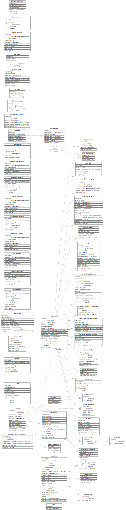

******
Design
******
This document describes the design of a new book server for Runestone implemented in this repository.  Over the last 10 years we have learned a lot, our Javascript and Python skills have improved. The Python world has added a lot of new tools and created web frameworks that are far more scalable that anything available in 2011 when this project first began.  This represents a partial port/rewrite of the work that has evolved over the years.  Its long past time to clean away the cruft of the many cooks that have contributed to the project.  The cruft is nobody's fault, it is just the natural result of a program that grew organically.

:index:`todo`: **This looks like a duplicate** of `goals` -- should we delete `goals`?

The goals for this new book server are as follows:

-   Separate the book server from the instructor/admin server
-   Move to `FastAPI <https://fastapi.tiangolo.com>`_ as the framework
-   Make this book server "pip installable" and a replacement for the current server used for the runestone serve command
-   Serve dynamic pages and handle all book interaction related API calls
-   Use SQLite or PostgreSQL database so that an author can install with minimal system dependencies
-   Design the book server to be highly scalable with Docker containers and a container manager like Kubernetes from the beginning.
-   Full system testability.
-   rename and reorganize the Runestone Component API using RESTful concepts to make it easier for others to learn and contribute to.

Project Organization
====================
.. image:: RunestoneArch.svg

.. code:: text

    BookServer/
    ├── Dockerfile
    ├── LICENSE
    ├── README.md
    ├── alembic
    │   ├── README
    │   ├── __pycache__
    │   │   └── env.cpython-39.pyc
    │   ├── env.py
    │   ├── script.py.mako
    │   └── versions
    ├── alembic.ini
    ├── app
    │   ├── __init__.py
    │   ├── applogger.py
    │   ├── crud.py
    │   ├── db.py
    │   ├── internal
    │   ├── main.py
    │   ├── models.py
    │   ├── routers
    │   │   ├── assessment.py
    │   │   ├── books.py
    │   │   └── rslogging.py
    │   ├── runestone_dev.db
    │   └── schemas.py
    ├── config.py
    ├── docs
    │   ├── RunestoneArch.svg
    │   ├── design.rst
    │   ├── runestone_erd.png
    │   └── runestone_erd.svg
    ├── poetry.lock
    ├── pyproject.toml
    ├── runestone_dev.db
    └── test
        ├── __init__.py
        └── test_rslogging.py

If you don't know anything about FastAPI please check out their docs and at least have a look at their basic tutorial.  It will orient you very quickly to the basic organization of a FastAPI project.

The API for the runestone books is organized as follows:

* rslogging.py - contains the two main APIs for dumping information into Runestone for click events and code running events.
* books.py -- contains the code for serving a page of the book.
* assessment.py -- contains the endpoints for retrieving results of assessment components.

The best way to see this structure and documentation for each endpoint is to start the book server and go to /docs

The `../app/applogger.py` file configures a logger for debug and error output.  Please use ``from applogger import rslogger`` and use ``rslogger.debug()`` rather than print statements for debugging.

The `../app/crud.py` file contains functions for CRUD (Create, Retrieve, Update, and Delete) operations on the major database tables. Using functions defined in this file should always be preferred to writing your own ad hoc query for accessing the database.

The `../app/db.py` file sets up an interface between SQLAlchemy and the databases package.  The ``databases`` package is used to provide asynchronous access to the database with queries built up using SQLAlchemy.

The `../app/models.py` file defines all of the tables used in Runestone. If you add a table please be sure to declare any indexes and constraints as part of the model definition.

The `alembic <https://alembic.sqlalchemy.org/en/latest/>`_ folder is used for database migrations.

The `../app/main.py` file pulls everything together. For development purposes you can run the book server with the command ``uvicorn app.main:app --reload --port 8080``.  This looks in the app module for main and loads the app object into the uvicorn ASGI server.

The Structure of a Runestone Book
---------------------------------
When one builds a runestone book you are building a *mostly* static web site.  But not entirely, each page contains some **template code** that gets filled in based on the characteristics of the student and the course.  An important concept in the runestone system is the difference between a *basecourse* and a bespoke course.  If you know object oriented programming think of the basecourse as the class and each bespoke course as an instance of that class.  When a page of a book is served the template allows instance variables to be populated for that student and that course.

Database Schema
---------------
The data model for Runestone is shown in the rather large diagram below.  The model is described in the app/models.py file.  This model is shared between the RunestoneComponents, the Admin Server and this Book Server.

We use the `SQLAlchemy Core API <https://docs.sqlalchemy.org/en/14/core/>`_ because much of what we need to do involves building up queries based on parameters rather than business object creation which would be more amenable to the ORM API.

For entry level purposes there are a handful of key tables

* ``useinfo`` - This table is basically a log of every click users make in the Runestone system.
* ``xxx_answers`` - This group of tables, one for each gradable runestone component stores the students answers in a form that is faster and easier to retrieve that going back to ``useinfo``.
* ``code`` - Every time a student changes and runs their code, the most recent copy of the code is stored in this table.
* ``courses`` -- every course supported by the runestone server has an entry in this table.

